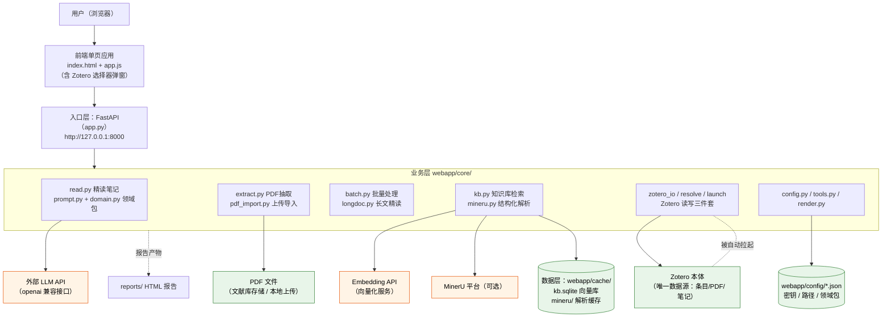
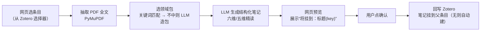

# literature_flow（论文搜集与整理）项目架构与上手指南

> 更新时间：2026-09-15 · 运行环境：Windows 本地

---

## 0. 项目速览

1. 这是一个**本地文献工作台**：以 Zotero 为唯一数据源，把论文从"订阅搜集 → 入库 → AI 精读笔记 → 语义检索知识库"串成一条流水线。
2. 技术形态很轻：**单个 Python 进程（FastAPI）+ 原生网页前端**，双击即用，无容器、无云端依赖。
3. 架构核心是三层：**FastAPI 接口层 → core 业务模块层（抽取/精读/批量/知识库/Zotero 读写）→ 数据层（Zotero 库 + SQLite 向量库）**。
4. 外部依赖三个服务：LLM API（生成笔记）、Embedding API（向量化，免费）、MinerU（PDF 结构化解析，可选）。
5. 最快跑起来：**双击 `webapp\start.bat`** → 浏览器自动打开 `http://127.0.0.1:8000` → 点「从 Zotero 选择」挑一篇文献即可生成精读笔记。

---

## 1. 项目架构总结

### 1.1 一句话定位

**literature_flow** 是一个跑在自己电脑上的"文献流水线"：自动盯期刊新论文、一键把 Zotero 里的 PDF 交给大模型做结构化精读笔记并回写 Zotero，再把全文切碎建成可自然语言检索的本地知识库。

### 1.2 技术栈

| 层 | 技术 | 说明 |
|---|---|---|
| 后端 | Python 3.13 + FastAPI + Uvicorn | 本地 Web 服务，`127.0.0.1:8000` |
| 前端 | 原生 HTML/JS/CSS（`templates/index.html` + `static/app.js`） | 无框架，单页应用 |
| PDF 处理 | PyMuPDF | 抽取 PDF 全文 |
| 结构化解析 | MinerU（可选，经 API） | 把 PDF 转成带标题层级的 Markdown，供知识库分块 |
| LLM 调用 | openai SDK（base_url 可换任意兼容服务） | 生成六维/五维精读笔记、自动造领域包 |
| 向量化 | 硅基流动 `BAAI/bge-m3`（1024 维） | 问题 1 次 API 向量化，本地 numpy 余弦检索 |
| 存储 | Zotero（条目/PDF/笔记，唯一数据源）+ SQLite（`webapp/cache/kb.sqlite` 分块+向量） | |
| Zotero 接口 | pyzotero（Zotero 本地 API）+ 自动拉起 Zotero 进程 | |
| 部署 | Windows 本地 `start.bat` / `serve.bat` | |

### 1.3 目录结构说明

```
literature_flow/
├─ webapp/                 ★ 主应用（FastAPI）
│  ├─ app.py               所有 HTTP 接口定义（入口）
│  ├─ start.bat            用户日常双击启动（自动开浏览器）
│  ├─ serve.bat            仅后台重启服务用（写 logs/server.log）
│  ├─ requirements.txt     Python 依赖清单
│  ├─ core/                ★ 业务核心（见 1.4）
│  ├─ static/ templates/   前端页面与脚本（含 Zotero 选择器弹窗）
│  ├─ config/              本地配置（密钥、路径、领域包；已 gitignore）
│  ├─ cache/               运行数据：kb.sqlite 向量库、mineru 解析缓存
│  └─ logs/                服务运行日志
├─ scripts/                独立脚本（按用途分组）
│  ├─ subscribe/           文献订阅：lit_watch.py + 期刊/关键词配置
│  ├─ dedup/               Zotero 条目去重（含历史方案 json/md）
│  ├─ tags/                标签分析与归并（含历史方案与提案）
│  ├─ pipeline/            笔记汇总管线：digest / 覆盖矩阵 / 素材包
│  └─ debug/               调试小工具（zot_read.py）
├─ docs/                   文档：本指南 + docs/research/（llm-for-zotero 研究笔记）
├─ notes/                  写作素材包 material_pack.md（webapp 引用，勿移动）
├─ reports/                生成的报告（archive/ 子目录放历史样例）
├─ archive/                一次性数据产物（digest json、refs 等）
└─ README.md               项目指路
```

### 1.4 核心模块与功能

| 模块（webapp/core/） | 职责 | 关键文件 | 对外能力 |
|---|---|---|---|
| Zotero 读写 | 条目/分类/搜索/写笔记/建父条目，自动拉起 Zotero | `zotero_io.py`、`zotero_resolve.py`、`zotero_launch.py` | `/api/zotero_*`、`/api/writeback` |
| 全文抽取 | 按 Zotero key 找 PDF 并抽全文 | `extract.py`、`pdf_import.py` | `/api/process_key`、`/api/pdf_import/*` |
| 精读笔记 | LLM 按领域包维度生成结构化笔记 | `read.py`、`prompt.py`、`domain.py` | `/api/process`（六维/五维笔记） |
| 批量处理 | 候选筛选 + 后台批量生成笔记 | `batch.py` | `/api/batch/candidates\|start\|status\|stop` |
| 长文精读 | 整本书/长文档分章精读，上传或选条目 | `longdoc.py` | `/api/longdoc/*` |
| 知识库（语义检索） | MinerU md → 分块 → embedding → SQLite 向量库 → 自然语言检索 | `kb.py`、`mineru.py` | `/api/kb/stats\|index\|search`、`/api/mineru/*` |
| 领域包 | 按学科自动选/生成笔记维度模板 | `domain.py` + `config/domains/*.json` | `/api/domain` |
| 渲染与工具 | 笔记转 HTML、报告入口、设置读写 | `render.py`、`tools.py`、`config.py` | `/api/tool/*`、`/api/settings` |

### 1.5 数据流与启动流程

**主数据流（精读一条文献）：**

```
用户在网页点「从 Zotero 选择」→ 选条目（有 PDF）
  → core/extract 用 PyMuPDF 抽全文
  → core/domain 选领域包（关键词匹配 → 不中则 LLM 造包）
  → core/read 调 LLM 生成结构化笔记（Markdown）
  → 网页展示"将挂到：某条目"，用户确认
  → /api/writeback 经 pyzotero 把笔记写回 Zotero（无父条目则自动建）
```

**知识库数据流：**

```
MinerU 结构化解析 PDF → Markdown → 按标题分块
  → 每块调 embedding API 得 1024 维向量 → 存 kb.sqlite
  → 用户提问 → 问题向量化 → 本地 numpy 余弦取 Top-K 段落 → 网页展示证据出处
```

**启动流程：**

```
双击 webapp/start.bat
  1) 杀掉占用 8000 端口的旧进程
  2) 3 秒后自动用默认浏览器打开 http://127.0.0.1:8000
  3) 用虚拟环境里的 Python 启动 uvicorn
  4) FastAPI startup 钩子后台线程检测并自动拉起 Zotero
  → 服务就绪
```

### 1.6 配置项说明

| 配置文件 | 内容 | 必填 | 备注 |
|---|---|---|---|
| `webapp/config/settings.json` | `model` / `base_url` / `api_key`（LLM） | 是 | 页面"设置"里可改 |
| `webapp/config/embedding.json` | `provider` / `base_url` / `model` / `api_key` | 知识库功能必填 | 当前：硅基流动 bge-m3（免费） |
| `webapp/config/paths.json` | Zotero 数据目录 / Zotero 程序路径 | 是 | 换机器必改 |
| `webapp/config/domain.json` | 当前激活的领域包 slug | 否 | 不存在时回退默认 |
| `webapp/config/domains/*.json` | 各学科维度模板 + 关键词 | 否 | 用户数据，可手工编辑调整维度 |
| `webapp/core/mineru_key.txt` | MinerU 平台 key | 长文/知识库解析必填 | |
| `scripts/subscribe/lit_journals.txt` / `lit_keywords.txt` | 订阅期刊名单 / 关键词 | 订阅功能用 | 配合 `lit_watch.py` |

> 密钥均为**明文本地存储**，已通过 `.gitignore` 排除出版本库——不要把项目目录直接打包分享给他人。

### 1.7 部署与运行方式

- **当前方式**：Windows 本机运行，`start.bat`（日常）或 `serve.bat`（静默重启）。Python 使用独立虚拟环境（`start.bat` 自动调用，不必记忆路径）。
- **换机部署步骤**：装 Python 3.13+ 与 Zotero 7 → 建 venv 并 `pip install -r webapp\requirements.txt` → 修改 `config/` 下的路径与密钥 → 双击 start.bat。
- **暂无 Docker / 云部署**：代码强依赖本机 Zotero（本地 API + 数据目录），上云需要重新设计，暂不建议。
- **检索能力升级路线**（可选）：库规模涨到上千篇后，可把 `core/kb.py` 的检索端替换为 RAGFlow 等专业 RAG 平台的 API（保留 Zotero 管线不动），或在现有代码内加混合检索（向量 + BM25）与重排。

---

## 2. 架构图

### 2.1 总体架构图



### 2.2 精读主流程（数据流图）



---

## 3. 小白上手指南（完全不懂编程也能跑）

### 3.1 这是个什么软件？能帮我干什么？

把它想象成一位**住在 Zotero 里的论文管家**。你平时用 Zotero 收集论文，这位管家可以：

1. **帮你读论文**：选一篇有 PDF 的文献，它让 AI 按固定框架（比如"研究问题 / 材料与方法 / 结论 / 局限"等维度）写一份精读笔记，直接存回 Zotero。
2. **帮你批量读**：勾选一批文献，后台一篇篇自动写笔记。
3. **帮你找**：把论文全文建成"可搜索的知识库"，以后用大白话问"哪篇文献提过某领域的直接证据？"，它能翻出原文段落。
4. **帮你盯新论文**：按期刊名单和关键词自动搜集英文新文献线索。

适合谁：**用 Zotero 管理文献、想让 AI 帮忙精读和检索的研究者**。不适合想多人协作/云端访问的场景——它只跑在你自己电脑上。

### 3.2 需要准备什么（一次性检查）

| 准备项 | 怎么确认 | 缺了怎么办 |
|---|---|---|
| Zotero 已安装且登录 | 能正常打开 Zotero、库里能看到文献 | 去 zotero.org 下载安装 |
| Zotero 里装好插件（茉莉花 Jasminum 等） | Zotero → 工具 → 插件 | 本项目不代装，手动装 |
| Python 虚拟环境 | 本机已预置（`start.bat` 会自动调用，无需手动操作） | 换机时：装 Python 3.13，建 venv，`pip install -r webapp\requirements.txt` |
| LLM 的 API key | `webapp\config\settings.json` 里有 `api_key` | 页面右上"设置"里填（这是少数需要手填的东西） |
| Embedding key（知识库功能） | `webapp\config\embedding.json` | 同上 |

### 3.3 最短成功路径（3 步）

> 第 1 步：**双击 `webapp\start.bat`**。
> 预期：黑色命令行窗口弹出并滚动日志，约 3 秒后浏览器自动打开 `http://127.0.0.1:8000`，Zotero 也可能被自动拉起。
>
> 第 2 步：**在网页上点「从 Zotero 选择」**，在弹出的选择器里搜索并挑一篇**带 PDF** 的文献。
> 预期：输入框显示这篇文献的标题（你不需要碰任何代码或编号）。
>
> 第 3 步：**点「开始精读」**，等进度提示完成。
> 预期：网页出现结构化笔记；回到 Zotero 刷新，能看到这篇文献下多了一条笔记。

成功！关闭软件：直接关掉那个黑色命令行窗口即可（Zotero 不受影响）。

### 3.4 常见使用场景

- **批量写笔记**：进"批量"面板 → 列表会自动排除已有笔记的条目 → 选数量开始 → 可随时停止。
- **知识库检索**：先在"知识库"面板点一次"建立索引"（需要有 MinerU 解析缓存），然后在检索框用自然语言提问。
- **长文档精读**：长文面板同样用"从 Zotero 选择"（只允许挑有 PDF 的条目），支持限章节数试跑。
- **调整笔记维度**：编辑 `webapp\config\domains\` 下对应学科的 JSON（改维度名/关键词），保存后下次精读生效。
- **订阅新文献**：编辑 `scripts\subscribe\` 里的两个文本文件（期刊名单、关键词），运行 `python scripts\subscribe\lit_watch.py`，报告出现在 `reports\`。

### 3.5 常见错误与解决

| 现象 | 原因 | 解决 |
|---|---|---|
| 打开浏览器显示"无法访问此网站" | 服务没起来或 8000 端口被占 | 等 3~5 秒刷新；仍不行看命令行窗口报错；或重启 start.bat（它会自动清掉占用端口的旧进程） |
| Zotero 没有自动打开 | `config/paths.json` 里路径不对 | 手动打开 Zotero 再用；换过 Zotero 安装位置需改该文件 |
| 点精读报"API key 无效/余额不足" | LLM 密钥错或欠费 | 页面"设置"里更新密钥 |
| 知识库检索提示"未配置 embedding" | `embedding.json` 缺失/为空 | 填入向量化服务的 key（免费注册即得） |
| 知识库检索结果很少/为空 | 还没建索引 | 先点"建立索引"，等它跑完 |
| 精读出来的维度不像这个学科 | 领域包没匹配上，回退了默认包 | 在 `config/domains/` 里给对应学科包补充关键词 |
| 命令行一闪而过、服务没起来 | `.bat` 编码/路径问题 | 右键 start.bat → 编辑，确认路径；或在 `webapp` 目录手动命令行启动 |

### 3.6 目录导览：哪些不用管，哪些可能要改

| 文件/目录 | 要不要碰 |
|---|---|
| `webapp/core/`、`static/`、`templates/`、`app.py` | ❌ 程序代码，不懂编程别动 |
| `webapp/cache/` | ❌ 系统自动生成的数据（含知识库），删了要重建 |
| `webapp/logs/`、`__pycache__/` | ❌ 日志/缓存，不用管 |
| `notes/`、`reports/`、`archive/` | 👀 看产出可以，别改（前两者被 webapp 引用） |
| `scripts/`、`docs/` | 👀 需要时再用，日常不用动 |
| `webapp/config/*.json` | ✅ **要改的就是这里**：密钥、Zotero 路径、学科维度 |
| `scripts/subscribe/lit_journals.txt`、`lit_keywords.txt` | ✅ 想订阅哪些期刊/关键词，编辑这两个文本文件 |

### 3.7 最小可用示例（30 秒验证装好了）

浏览器地址栏输入 `http://127.0.0.1:8000/api/zotero_ping`：

- 看到 JSON（类似 `{"ok": true, ...}`）→ Zotero 连接正常，一切就绪；
- 报错 → Zotero 没开，先打开 Zotero 再刷新。

### 3.8 术语小抄

- **API**：程序之间"对话"的窗口，本软件的网页就是通过它和后台沟通。
- **venv（虚拟环境）**：给这个项目单独准备的一套 Python，不弄脏系统。
- **Embedding（向量化）**：把一句话变成一串数字，让电脑能算"两句话像不像"。
- **领域包**：针对某学科预设好的"笔记模板"，决定 AI 从哪几个角度精读。
- **回写**：把 AI 生成的笔记存回 Zotero 对应条目下。
