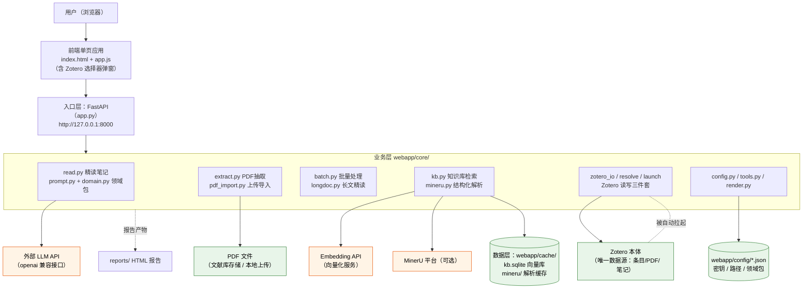
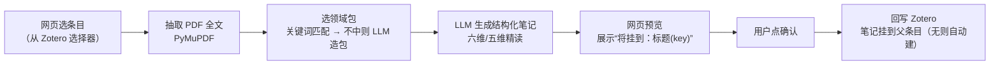

# literature_flow 项目架构与开发指南

> 更新时间：2026-09-17 · 运行环境：Windows 本地

**这份文档写给谁**：想读懂代码结构、要改功能、要排查故障的人。

**想把它用起来**（装依赖、填配置、开始读文献）→ 直接看根目录 **`README.md`**。使用说明只有那一处，
本文不重复，避免两边各写一份、改一处忘一处。

本文覆盖：技术栈、模块职责、数据流、架构图、目录明细、配置项键名，以及两则开发时会用到的附录。

---

## 1. 项目架构总结

### 1.1 一句话定位

**literature_flow** 是一个跑在自己电脑上的"文献流水线"：自动盯期刊新论文、一键把 Zotero 里的 PDF 交给大模型做结构化精读笔记并回写 Zotero，再把全文切碎建成可自然语言检索的本地知识库。

### 1.2 技术栈

| 层 | 技术 | 说明 |
|---|---|---|
| 后端 | Python 3.13 + FastAPI + Uvicorn | 本地 Web 服务，`127.0.0.1:8000` |
| 前端 | 原生 HTML/JS/CSS（`templates/index.html` + `static/app.js`） | 无框架，单页应用 |
| PDF 处理 | PyMuPDF | 抽取 PDF 全文 |
| 结构化解析 | MinerU（可选，经 API） | 把 PDF 转成带标题层级的 Markdown，供知识库分块 |
| LLM 调用 | openai SDK（base_url 可换任意兼容服务） | 生成六维/五维精读笔记、自动造领域包 |
| 向量化 | 硅基流动 `BAAI/bge-m3`（1024 维） | 问题 1 次 API 向量化，本地 numpy 余弦检索 |
| 存储 | Zotero（条目/PDF/笔记，唯一数据源）+ SQLite（`webapp/cache/kb.sqlite` 分块+向量） | |
| Zotero 接口 | pyzotero（Zotero 本地 API）+ 自动拉起 Zotero 进程 | |
| 部署 | Windows 本地 `start.bat` / `serve.bat` | |

### 1.3 目录结构说明

```
literature_flow/
├─ webapp/                 ★ 主应用（FastAPI）
│  ├─ app.py               所有 HTTP 接口定义（入口）
│  ├─ setup.bat            首次安装：找 Python + 建 venv + 装依赖 + 探测 Zotero 路径
│  ├─ setup_env.py         setup.bat 调用的配置探测（只补空缺，不覆盖已填值）
│  ├─ start.bat            用户日常双击启动（自动开浏览器）
│  ├─ serve.bat            仅后台重启服务用（写 logs/server.log）
│  ├─ requirements.txt     Python 依赖清单
│  ├─ core/                ★ 业务核心（见 1.4）
│  ├─ static/ templates/   前端页面与脚本（含 Zotero 选择器弹窗）
│  ├─ config/              本地配置（密钥、路径、领域包；已 gitignore）
│  ├─ cache/               运行数据：kb.sqlite 向量库、mineru 解析缓存
│  └─ logs/                服务运行日志
├─ scripts/                独立脚本（按用途分组）
│  ├─ subscribe/           文献订阅：lit_watch.py + 期刊/关键词配置
│  ├─ dedup/               Zotero 条目去重（含历史方案 json/md）
│  ├─ tags/                标签分析与归并（含历史方案与提案）
│  ├─ pipeline/            笔记汇总管线：digest / 覆盖矩阵 / 素材包
│  └─ debug/               调试小工具（zot_read.py）
├─ docs/                   文档：本指南（docs/research/ 为个人研究笔记，不入库）
├─ notes/                  写作素材包 material_pack.md（webapp 引用，勿移动）
├─ reports/                生成的报告（archive/ 子目录放历史样例）
├─ archive/                一次性数据产物（digest json、refs 等）
└─ README.md               使用说明：安装 / 配置 / 使用 / 排错的唯一出处
```

> 上表中属个人数据的部分（`config/` 真实配置、`cache/`、`logs/`、`docs/research/`、
> `scripts/*/` 里的个人预设脚本与历史方案、`notes/`、`reports/`、`archive/`）**不入库**，
> clone 下来会缺这些内容，属正常现象。完整清单见 `README.md` 第八节。

### 1.4 核心模块与功能

| 模块（webapp/core/） | 职责 | 关键文件 | 对外能力 |
|---|---|---|---|
| Zotero 读写 | 条目/分类/搜索/写笔记/建父条目，自动拉起 Zotero | `zotero_io.py`、`zotero_resolve.py`、`zotero_launch.py` | `/api/zotero_*`、`/api/writeback` |
| 全文抽取 | 按 Zotero key 找 PDF 并抽全文 | `extract.py`、`pdf_import.py` | `/api/process_key`、`/api/pdf_import/*` |
| 精读笔记 | LLM 按领域包维度生成结构化笔记 | `read.py`、`prompt.py`、`domain.py` | `/api/process`（六维/五维笔记） |
| 批量处理 | 候选筛选 + 后台批量生成笔记 | `batch.py` | `/api/batch/candidates\|start\|status\|stop` |
| 长文精读 | 整本书/长文档分章精读，上传或选条目 | `longdoc.py` | `/api/longdoc/*` |
| 知识库（语义检索） | MinerU md → 分块 → embedding → SQLite 向量库 → 自然语言检索 | `kb.py`、`mineru.py` | `/api/kb/stats\|index\|search`、`/api/mineru/*` |
| 领域包 | 按学科自动选/生成笔记维度模板 | `domain.py` + `config/domains/*.json` | `/api/domain` |
| 渲染与工具 | 笔记转 HTML、报告入口、设置读写 | `render.py`、`tools.py`、`config.py` | `/api/tool/*`、`/api/settings` |

### 1.5 数据流与启动流程

**主数据流（精读一条文献）：**

```
用户在网页点「从 Zotero 选择」→ 选条目（有 PDF）
  → core/extract 用 PyMuPDF 抽全文
  → core/domain 选领域包（关键词匹配 → 不中则 LLM 造包）
  → core/read 调 LLM 生成结构化笔记（Markdown）
  → 网页展示"将挂到：某条目"，用户确认
  → /api/writeback 经 pyzotero 把笔记写回 Zotero（无父条目则自动建）
```

**知识库数据流：**

```
MinerU 结构化解析 PDF → Markdown → 按标题分块
  → 每块调 embedding API 得 1024 维向量 → 存 kb.sqlite
  → 用户提问 → 问题向量化 → 本地 numpy 余弦取 Top-K 段落 → 网页展示证据出处
```

**启动流程：**

```
双击 webapp/start.bat
  1) 杀掉占用 8000 端口的旧进程
  2) 3 秒后自动用默认浏览器打开 http://127.0.0.1:8000
  3) 用虚拟环境里的 Python 启动 uvicorn
  4) FastAPI startup 钩子后台线程检测并自动拉起 Zotero
  → 服务就绪
```

### 1.6 配置项说明

> 用户视角的「在哪填、怎么填」见 **`README.md` 第四节**。这里只列**键名、必填性与对应界面入口**，供改代码时查。

| 配置位置 | 内容 | 必填 | 界面入口 |
|---|---|---|---|
| `webapp/config/settings.json` | `model` / `base_url` / `api_key`（LLM）；可选 `domain_backend`（领域包生成后端：`auto`/`api`/`webchat`，缺省 auto=有 key 走 API、无 key 走网页端）；`openalex_key` | 是 | ✅「设置 → 大模型 / OpenAlex」 |
| `webapp/config/paths.json` | `zotero_data_dir`（Zotero 数据目录）/ `zotero_exe`（程序路径）/ 写入授权密钥 | 是 | ✅「设置 → 本机路径」，支持**一键自动探测** |
| `webapp/config/embedding.json` | `provider` / `base_url` / `model` / `api_key` | 知识库功能必填 | ✅「设置 → 知识库向量模型」 |
| `webapp/config/domain.json` | 当前激活的领域包 slug | 否 | ❌ 手改文件；不存在时回退默认 |
| `webapp/config/domains/*.json` | 各学科维度模板 + 关键词 | 否 | ❌ 用户数据，手工编辑调整维度 |
| `webapp/config/mineru_key.txt` | MinerU 平台 key | 长文/知识库解析必填 | ✅「设置 → 知识库向量模型」；旧位置 `core/` 仍兼容读取 |
| `paths.json` 的 `data_dir` | 数据目录（缓存 / 向量库 / 浏览器内核） | 否 | ✅「设置 → 本机路径」，留空 = 项目内 `webapp/cache` |
| `scripts/subscribe/lit_journals.txt` / `lit_keywords.txt` | 订阅期刊名单 / 关键词 | 订阅功能用 | ❌ 手建，配合 `lit_watch.py` |

> **界面是主入口**：路径与密钥在页面「设置」里填完即生效（后端按运行时函数读取，不必重启服务）。
> Zotero 路径可点「自动探测」：从各 profile 的 `prefs.js`（`extensions.zotero.dataDir`）与注册表 `App Paths\zotero.exe` 找——
> 数据目录自定义过、Zotero 装在非默认盘都能找到；探测不到时用「浏览…」弹系统选择框，或直接手填。
> 缺必填项时页面顶部会出现引导横幅。
> 全部为**明文本地存储**，已通过 `.gitignore` 排除出版本库——不要把项目目录直接打包分享给他人。

### 1.7 部署与运行方式

- **当前方式**：Windows 本机运行，`start.bat`（日常）或 `serve.bat`（静默重启）。Python 使用独立虚拟环境（`start.bat` 自动调用，不必记忆路径）。
- **换机部署步骤**：装 Python 3.10+ 与 Zotero（7 及以上，实测 10.0.3）→ **双击 `webapp\setup.bat`**（自动建 venv、装依赖、探测 Zotero 路径）→ 双击 `start.bat` → 在页面「设置」里补上大模型密钥。
- **暂无 Docker / 云部署**：代码强依赖本机 Zotero（本地 API + 数据目录），上云需要重新设计，暂不建议。
- **检索能力升级路线**（可选）：库规模涨到上千篇后，可把 `core/kb.py` 的检索端替换为 RAGFlow 等专业 RAG 平台的 API（保留 Zotero 管线不动），或在现有代码内加混合检索（向量 + BM25）与重排。

---

## 2. 架构图

### 2.1 总体架构图



### 2.2 精读主流程（数据流图）



---

## 3. 附录

> 安装、配置、使用、排错一律见 **`README.md`**。下面两则是开发/维护时会用到、README 里没有的内容。

### 3.1 最小可用示例（30 秒验证装好了）

浏览器地址栏输入 `http://127.0.0.1:8000/api/zotero_ping`：

- 看到 JSON（类似 `{"ok": true, ...}`）→ Zotero 连接正常，一切就绪；
- 报错 → Zotero 没开，先打开 Zotero 再刷新。

### 3.2 术语小抄

- **API**：程序之间"对话"的窗口，本软件的网页就是通过它和后台沟通。
- **venv（虚拟环境）**：给这个项目单独准备的一套 Python，不弄脏系统。
- **Embedding（向量化）**：把一句话变成一串数字，让电脑能算"两句话像不像"。
- **领域包**：针对某学科预设好的"笔记模板"，决定 AI 从哪几个角度精读。
- **回写**：把 AI 生成的笔记存回 Zotero 对应条目下。
